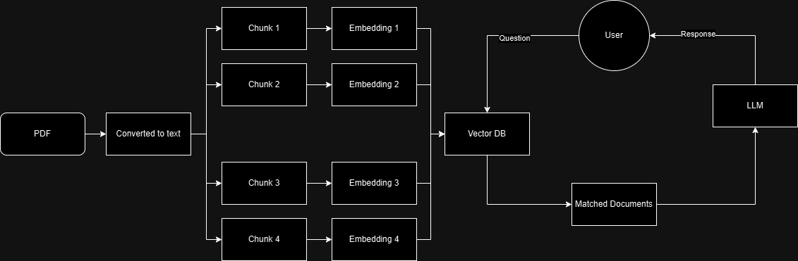

# ai-engineer-challenge

## Project Overview:

This project leverages LangChain's tools and OpenAI's language and embedding models to create an API server capable of handling conversational retrieval tasks. The project uses FastAPI to spin up a server, allowing external applications to interact with a pre-trained language model via a RESTful API endpoint.

### Detailed Workflow:

- File Loading: A PDF file named "AI Engineer.pdf" is loaded using PyPDFLoader, which extracts the document's content for further processing.

- Text Splitting: The text is divided into smaller chunks (10,000 characters with a 5-character overlap) using RecursiveCharacterTextSplitter. This allows for efficient embedding and retrieval of manageable segments of the document.

- Vector Store Initialization: The Chroma vector store is populated with embeddings of the text chunks, generated using the specified OpenAI embedding model (text-embedding-3-large). This vector store is set up in a persistent directory (data) to enable reusability of embeddings across sessions.

- Retriever and Conversational Chain: A retriever is created from the vector store, allowing relevant document segments to be retrieved based on query embeddings.
  The conversational chain is established using ConversationalRetrievalChain from LangChain, linking the language model (gpt-3.5-turbo-0125) with the retriever to facilitate contextual and interactive responses.

- API Endpoint Setup: The add_routes function attaches the conversational retrieval chain to the FastAPI app, exposing it via the /openai endpoint and can be used in a playgroud at /openai/playground.
  The server is configured to run locally on port 8000 using uvicorn.

## Diagram:

